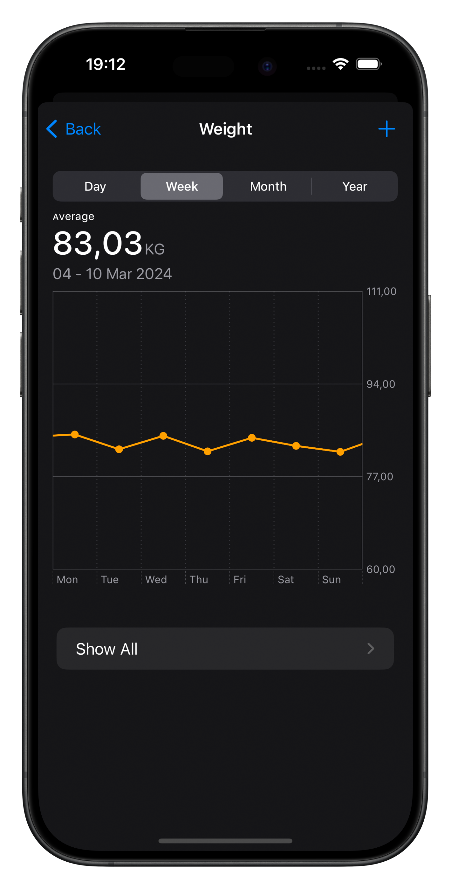
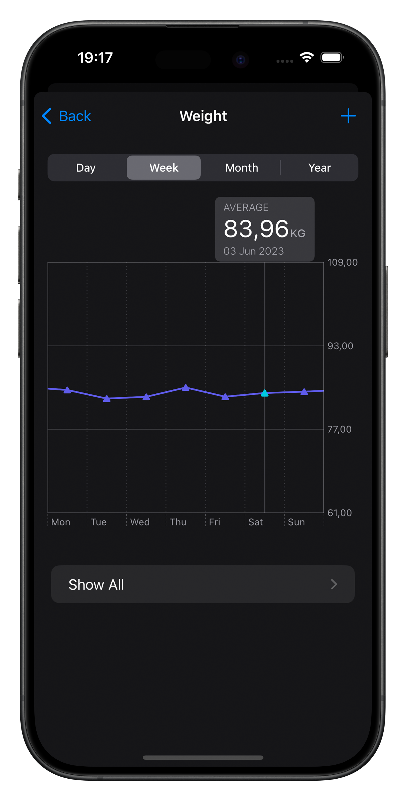

# MeasurementChartsUI

[](https://github.com/apple/swift-package-manager)

[](https://github.com/fcollf/MeasurementChartsUI/stargazers)

## Table of Contents
           
1. [Introduction](#introduction)
     - [Features](#features)
3. [Screenshots](#screenshots)
     - [Portrait View](#portrait-view)
     - [Landscape View](#landscape-view)
4. [Installing](#installing)
5. [Basic Usage](#basic-usage)
6. [Customizing Appearance](#customizing-appearance)
     - [Precision](#precision)
     - [Foreground Style](#foreground-style)
     - [Symbol Shape](#symbol-shape)
     - [Grouping Picker Visibility](#grouping-picker-visibility)
     - [Custom Header](#custom-header)
7. [License](#license)
                 
## Introduction

The `MeasurementChartsUI` package introduces a user-friendly SwiftUI `MeasurementChartView`, 
inspired by the native Apple Health's charts. 
It offers a comprehensive solution for displaying measurement data across various dimensions, 
making it easy to incorporate interactive scrollable charts into your SwiftUI applications.
                 
### Features

* **Apple Health-Inspired Design**: Draws inspiration from Apple Health's intuitive and informative charts.
* **Dynamic Grouping**: Supports various grouping strategies (daily, weekly, monthly, yearly).
* **Interactive Selection**: Enables users to select specific data points within the chart.
* **Custom Display Options**: Offers customization options for the display unit, precision, foreground style, and symbol shapes.
* **Custom Header**: Offers the ability to include a custom header for the chart.
 
## Screenshots
                 
Take a look at `MeasurementChartView` in action:

<p float="left">
  
  
</p>


## Installing

To integrate `MeasurementChartsUI` into your package, you can add it as a dependency in your `Package.swift` file:

```swift
dependencies: [
 .package(url: "https://github.com/fcollf/MeasurementChartsUI.git", .upToNextMajor(from: "1.0.0"))
]
```

Alternatively, if you're working on an Xcode project:

1. Open your project in Xcode.
2. Go to File -> Add Package Dependencies....
3. Paste the repository URL: <https://github.com/fcollf/MeasurementChartsUI>
4. Choose the version you want to use (e.g., Up to Next Major).

Xcode will fetch the latest version of `MeasurementChartsUI` and integrate it into your project.
                             
## Basic usage
                
After installing the MeasurementChartsUI package in your project, incorporating the `MeasurementChartView` 
into your SwiftUI application involves a few simple steps:

### Step 1: Import `MeasurementChartsUI`

Begin by importing the `MeasurementChartsUI` package in the SwiftUI view file where the chart will be displayed:
                    
```swift
    import MeasurementChartsUI
```

### Step 2: Conform Your Data Entries to `ChartDataEntry`

Your data model must conform to the `ChartDataEntry` protocol. 
This ensures each data entry has a date and a measurement:
                    
```swift
struct MyMeasurementEntry<U: Dimension>: ChartDataEntry {

    // Conformance to Identifiable
    var id = UUID()

    // Date of the measurement
    var date: Date

    // Measured data
    var measurement: Measurement<U>
}
```
                 
### Step 3: Initialize `MeasurementChartView` with your entries

To display your measurement data, instantiate `MeasurementChartView` in your SwiftUI view by 
passing in your sequence of measurement entries. Optionally, you can also choose a default 
grouping strategy for the data presentation. 

Here's a simple example to get started:
                    
```swift
                 
struct ContentView: View {

     let entries: [MyMeasurementEntry<UnitMass>] = [
         // Your array of measurement entries goes here
     ]

    var body: some View {
        MeasurementChartView(entries, displayIn: .kilograms, grouping: .weekly)
    }
}
```

> [!TIP]
> To focus the chart on a specific point in time, you can pass a `Date` object to the initializer
> This lets you highlight data for a particular date, immediately bringing it to the user's attention,
> and enhancing the chart's contextual relevance:
>
> ```swift
> MeasurementChartView(entries, displayIn: .kilograms, displayAt: .now, grouping: .weekly)
> ```
>
> If no date is specified, the chart will automatically display the page for the most recent 
> measurement available.
                 
## Customizing Appearance

`MeasurementChartView` offers a range of modifiers to customize its appearance, including 
options for unit display, precision, foreground styles, symbol shapes, and more. 

Here’s how you can use these modifiers to tailor the chart to your preferences:

### Precision

Adjust the number of decimal places for measurement values displayed in the chart. 
This allows you to control the granularity of the data presentation.

```swift
MeasurementChartView(entries, displayIn: .kilograms, grouping: .weekly)
    .precision(2) // Displays values with two decimal places
```

### Foreground Style

Customize the appearance of the chart's foreground elements, like lines and symbols, using any `ShapeStyle`. 
Additionally, specify a distinct style for the marker when selecting an element in the chart with the selection parameter. 

If no selection style is specified, the chart uses the default foreground style for selected elements.

```swift
MeasurementChartView(entries, displayIn: .kilograms, grouping: .weekly)
    .foregroundStyle(Color.blue, selection: Color.red)
```

### Symbol Shape

Change the shape of the symbols used in the chart, like the points representing data entries. 
This can enhance the visual distinction of your data points.

```swift
MeasurementChartView(entries, displayIn: .kilograms, grouping: .weekly)
    .symbolShape(.diamond)
```

### Grouping Picker Visibility

Control the visibility of the grouping picker, which allows users to switch between 
different grouping modes (`daily`, `weekly`, `monthly`, `yearly`).

```swift
MeasurementChartView(entries, displayIn: .kilograms, grouping: .weekly)
    .groupingPickerHidden()
```

### Custom Header

Incorporate a custom header into your chart for additional context or controls. 
This is done by utilizing the initializer that accepts a view builder.

```swift
MeasurementChartView(entries, displayIn: .kilograms, grouping: .weekly) {
    Text("Custom Header")
}
```

## License

This package is licensed under the MIT License - see the [LICENSE](LICENSE) file for details
